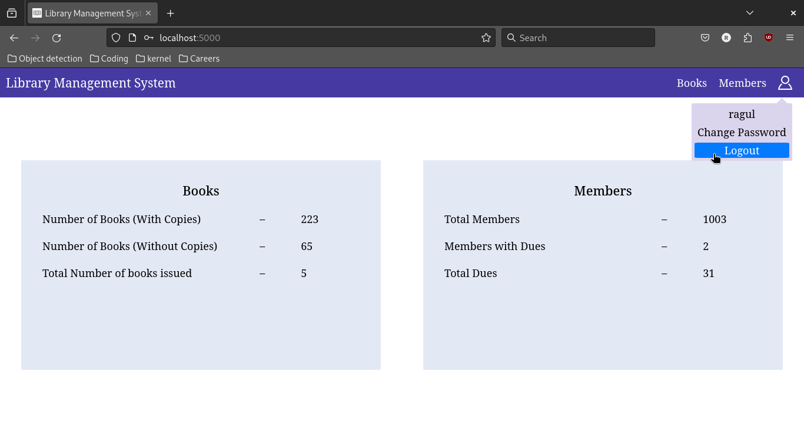
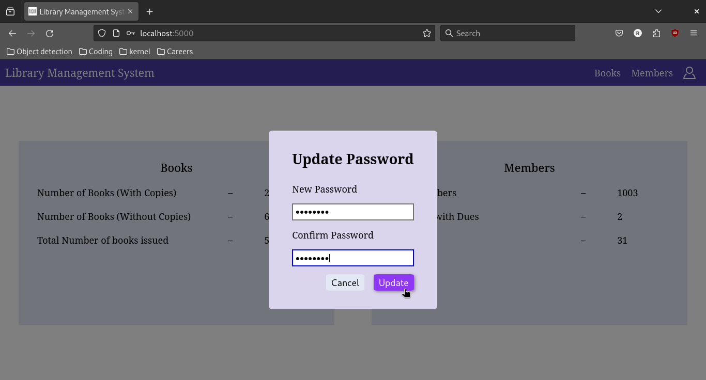
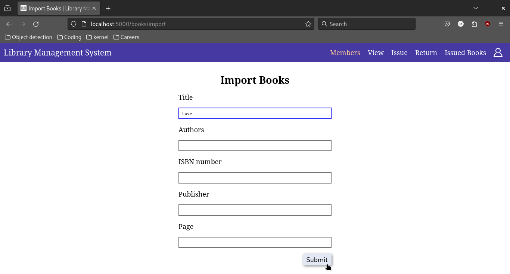
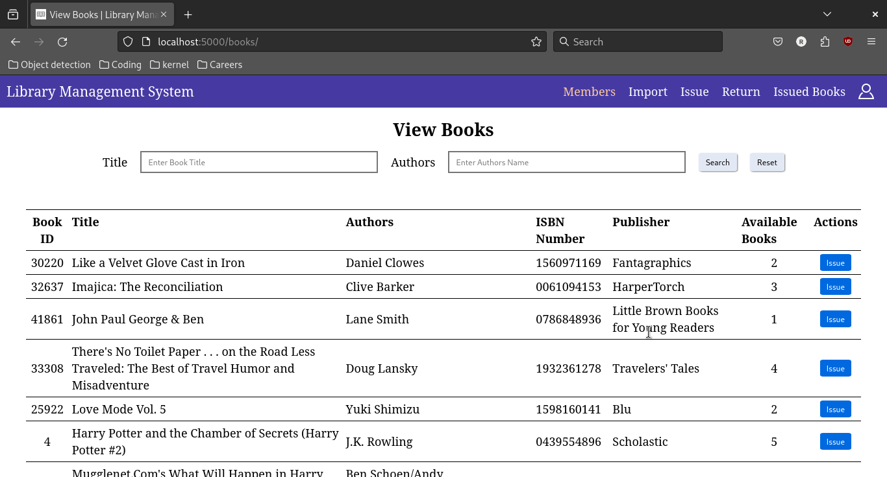
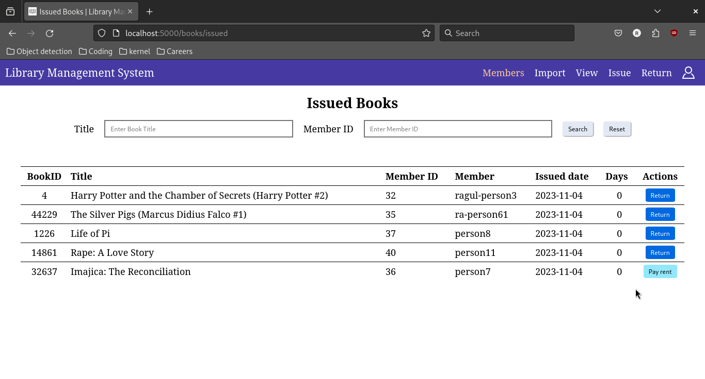
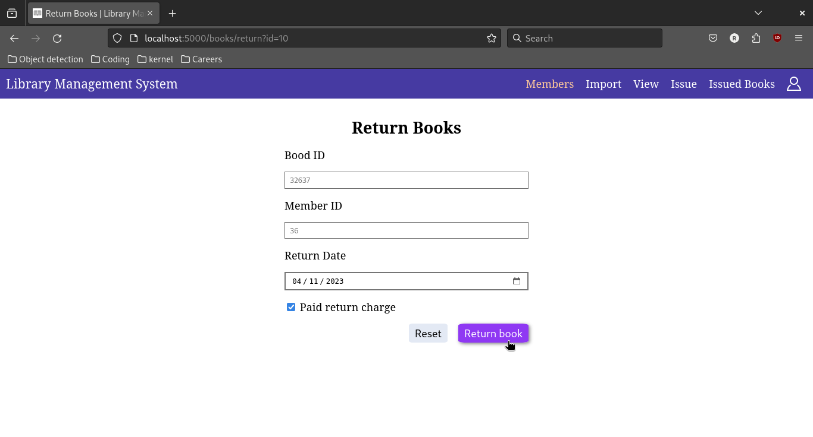
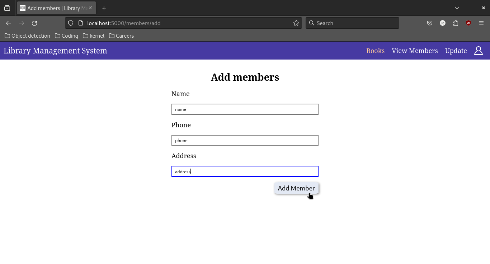
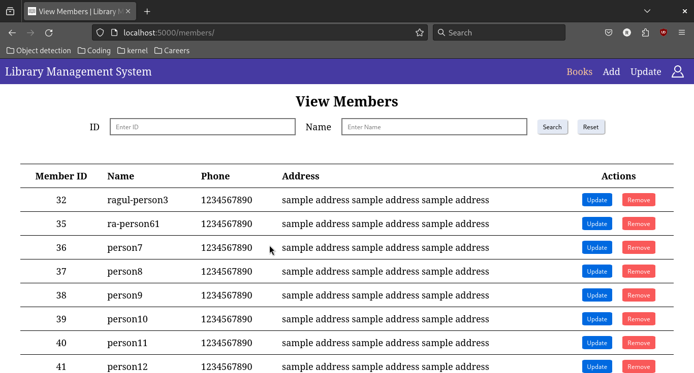
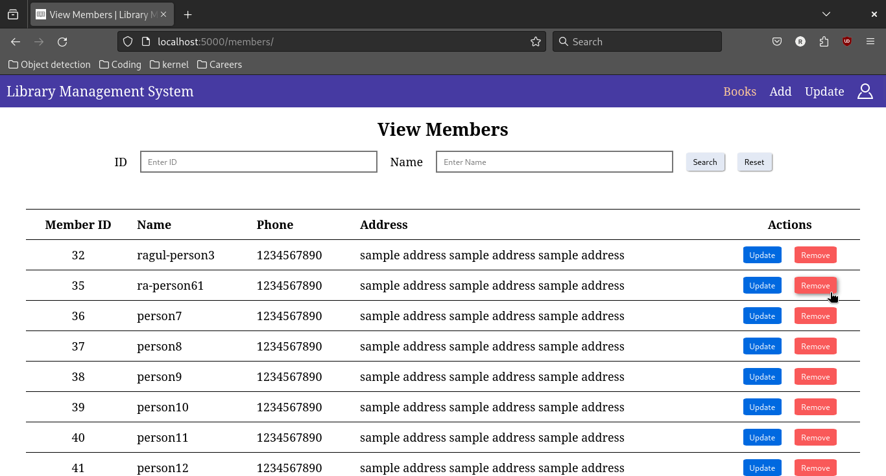
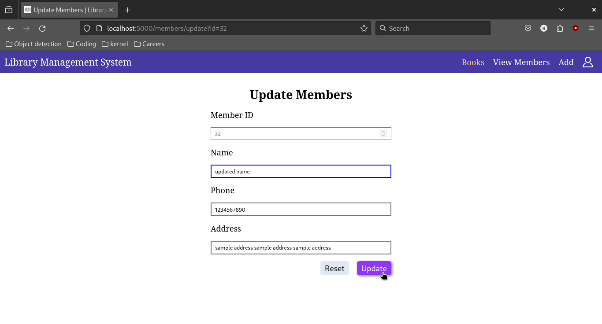

# Library Management System


## How to run this application?

### Setting up database

Our application uses [PostgreSQL database](https://www.postgresql.org/). See Installation guide in the docs.

For Debian based systems:

```bash
sudo apt install postgresql
```

### Run the application

```bash
. ./venv/bin/activate # activate virtual environment

## Install requirements
pip install -r requirements.txt

## Run the application
flask --app src run
```

## Index page

Librarian will be able to the Number of Books with and without Copies in the database, total number of books issued, total members, total member with dues, total dues in the index page.

1. Librarian can change their password by clicking `<Profile photo>` -> `Change Password`
2. Logging out the application can be done by `<Profile photo>` -> `Logout`




## Books

### Import books

A form is provided to librarian to give details about the books he/she want to import. All the fields are optional. Books will be fetched from frappe API.



### View books

All the books in the database will be listed here with available quantity (number of copies currently available in library). 
Books can be issued from here by clicking the `Issue` button.

1. Books can be issued by clicking the `Issue` button.
2. We can query the books list by the `book title` and `book authors`



### Issue Book

There are two ways to issue a book:

1. By clicking `Issue` button in the `/books/` page. Every information will be autofilled except Member ID. (_**preffered**_)
2. Manually entering the details.
    1. Librarian have to type `Book ID`.
    2. When the focus is lost in Book ID input field, `title` and `authors` will be autofilled.
    3. When librarian enters any incorrect data, error will be show.


### View Issued Books

All the books issued will be listed here. Details like `Issued date`, `Number of days since issued` will also be shown here.

1. Books can be returned by clicking the `Return` button.
2. Dues can be paid by clicking the `Pay Rent` button.
3. We can query the issued books list by the `book title` and `book authors`



### Return Book

There are two ways to return a book:

1. By clicking `Return` button in the `/books/issued` page. Every information will be autofilled. Librarian can only change the return date. (_**preffered**_)
2. Manually entering the details.
    1. Library will enter the Book and Member ID. We can also change the return date.

Members can pay the due when returning book or later. Accordingly, the `Paid return charge` checkbox will be checked.



## Members

### Add Members

Librarian will enter the details like `name`, `phone`, `address`.



### View Members

Member details will be shown here.

1. Remove a member by pressing `Remove` button.
2. Update a member by pressing `Update` button.
3. Query the members list by `ID`, `Name`.



### Remove Member

See [View Member](#view-members)



### Update Member

There are two ways to update a member:

1. By clicking `Update` in `/members` page. (_**preffered**_)
2. Manually entering the details.
    1. Librarian has to enter `Member ID`.
    2. The member details will be autofilled. So we can edit the information.


